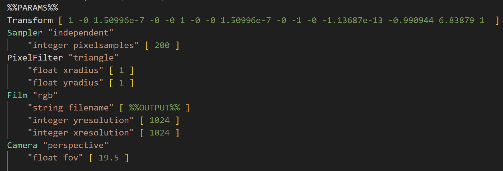

Guide D’utilisation Pour la plateforme de Comparaison des rendus

Réalisé Par : BOULERHCHA Hassan-Walid

1.	Présentation
La plateforme de test pour la comparaison des rendus est un outil qui permet à l’utilisateurs d’avoir une comparaison entres des rendus qui sont générés par lui-même dans l’application à partir des scènes, afin de savoir qu’elles sont les meilleurs paramètres à intégrer dans une scène. 
Donc la plateforme est divisée en 4 grande partie :
-	Gestion des scènes : Permet de d’ajouter des scènes a la base de données de la plateforme.

-	Gestion des configurations : Permet d’ajouter soit une nouvelle configuration qui est une combinaison d’intégrateur et paramètres, soit une nouvelle version d’une combinaison existante avec le même intégrateur mais des paramètres différents.

-	Génération des rendus : Permet à l’utilisateur de choisir les scènes ainsi que les configurations qui vont être intégrer dans ces scènes et générer par le moteur de génération indiquer par l’utilisateur.

-	Comparaison : Permet de comparer les rendus générer et stockés dans la base de données de la plateforme avec le choix d’avoir des images de fausses couleurs de ces rendus 

2.	Utilisation :
2.1.	Gestion des scènes :

-	Nom de la scène : doit être un nom qui n’existes pas dans la base de donner des scènes.
-	Bouton choisir un zip : le fichier zip doit contenir un dossier d’une scène, ce dossier doit contenir un fichier avec le nom « scene.pbrt », ce dernier dois contenir des indice (%%PARAMS%% et %%OUTPUT%%) au début du fichier  comme indiqué dans ci-dessous :

 
-	Bouton choisir une référence : le fichier référence doit être soit un .png ou .exr et dois correspondre a la scène dans le fichier zip choisi
-	Liste des scènes : affiche les scènes qui existe dans la base de données de la plateforme avec la possibilité de supprimer ces scènes 
-	Survolez les nom des scènes pour les affichés 
Remarque : la comparaison va être base sur le type du fichier de référence, si c’est un .exr les calculs et la comparaison vont être avec le .exr sinon les calcul vont être avec le .png 

2.2.	Gestion des configurations :
-	Nouvelle configuration :
•	Nom de configuration : c’est le nom de l’intégrateur, il ne doit pas exister dans la base de données. Vous pouvez s’appuyez sur la liste des configurations.
•	« + » : permet d’ajouter d’autre nouveaux paramètres a ajoutés  
•	Type : est le type de paramètre. Soi : integer - float - bool – string .
•	Paramètre : est le nom du Paramètre.
•	Valeur : est la valeur du Paramètre.
-	Nouvelle version : 
•	A la place du champ pour le nouvel intégrateur, vous avez la liste des intégrateurs qui existe  

2.3.	Génération des rendus :
-	Liste des configurations : Cochez les check-box pour choisir les configurations 
-	Liste des scènes : Cochez les check-box pour choisir les scènes 
-	URL du Moteur : copier le chemin absolu de votre moteur PBRT 
Remarque : Pour chaque scène choisie, le système génère des rendus avec chaque                           configuration. Les rendus sont stockés avec la date de la génération 

2.4.	Comparaison :
-	Chaque combinaison de "version" et de "date" vous permet de sélectionner une configuration que vous souhaitez comparer, ainsi que la date à laquelle les rendus ont été générés avec cette configuration. 
-	L'option "+" vous permet d'ajouter d'autres paires de "version" et de "date", ce qui vous permet de comparer une ou plusieurs configurations avec des dates différentes.
-	Options : vous pouvez choisir les options des fausses images que vous souhaitez inclure dans cette comparaison.
-	La section "Images Affichées" affiche les rendus qui seront comparés lorsque vous appuyez sur le bouton "Comparer". 
-	La section "Images Non Affichées" affiche les rendus qui manquent dans l'une des dates sélectionnées, ce qui les exclus de la comparaison.
Remarque : Vous pouvez survoler les rendus dans la liste "Images Non Affichées" pour déterminer où il manque des données.

